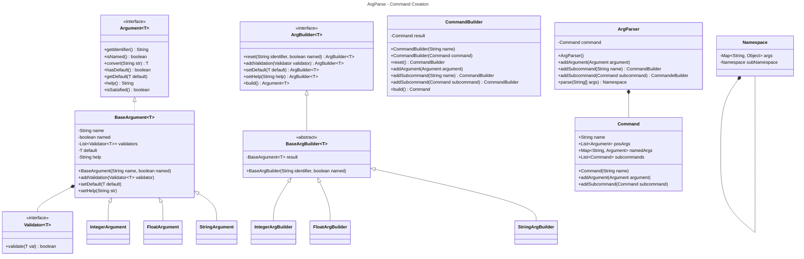

```mermaid
---
title: ArgParse - Command Creation
---
classDiagram
    class Argument~T~ {
        <<interface>>
        +getIdentifier() String
        +isNamed() boolean
        +convert(String str) T
        +hasDefault() boolean
        +getDefault(T default)
        +help() String
        +isSatisfied() boolean
    }
    Argument~T~ <|.. BaseArgument~T~
    BaseArgument: -String name
    BaseArgument: -boolean named
    BaseArgument: -List~Validator~T~~ validators
    BaseArgument: -T default
    BaseArgument: -String help
    BaseArgument: +BaseArgument(String name, boolean named)
    BaseArgument: +addValidation(Validator~T~ validator)
    BaseArgument: +setDefault(T default)
    BaseArgument: +setHelp(String str)
    BaseArgument *-- Validator~T~
    BaseArgument~Integer~ <|-- IntegerArgument
    BaseArgument~Float~ <|-- FloatArgument
    BaseArgument~String~ <|-- StringArgument
    <<interface>> Validator
    Validator: +validate(T val) boolean
    class ArgBuilder~T~ {
        <<interface>>
        +reset(String identifier, boolean named) ArgBuilder~T~
        +addValidation(Validator validator) ArgBuilder~T~
        +setDefault(T default) ArgBuilder~T~
        +setHelp(String help) ArgBuilder~T~
        +build() Argument~T~
    }
    ArgBuilder~T~ <|-- BaseArgBuilder~T~
    class BaseArgBuilder~T~ {
        <<abstract>>
        -BaseArgument~T~ result
        +BaseArgBuilder(String identifier, boolean named)
    }
    BaseArgBuilder~Integer~ <|-- IntegerArgBuilder
    BaseArgBuilder~Float~ <|-- FloatArgBuilder
    BaseArgBuilder~String~ <|-- StringArgBuilder
    class Command {
        +String name
        +List~Argument~ posArgs
        +Map~String, Argument~ namedArgs
        +List~Command~ subcommands
        +Command(String name)
        +addArgument(Argument argument)
        +addSubcommand(Command subcommand)
    }
    class CommandBuilder {
        -Command result
        +CommandBuilder(String name)
        +CommandBuilder(Command command)
        +reset() CommandBuilder
        +addArgument(Argument argument)
        +addSubcommand(String name) CommandBuilder
        +addSubcommand(Command subcommand) CommandBuilder
        +build() Command
    }
    ArgParser *-- Command
    class ArgParser {
        -Command command
        +ArgParser()
        +addArgument(Argument argument)
        +addSubcommand(String name) CommandBuilder
        +addSubcommand(Command subcommand) CommandeBuilder
        +parse(String[] args) Namespace
    }
    class Namespace {
        -Map~String, Object~ args
        -Namespace subNamespace
    }
    Namespace *-- Namespace
```