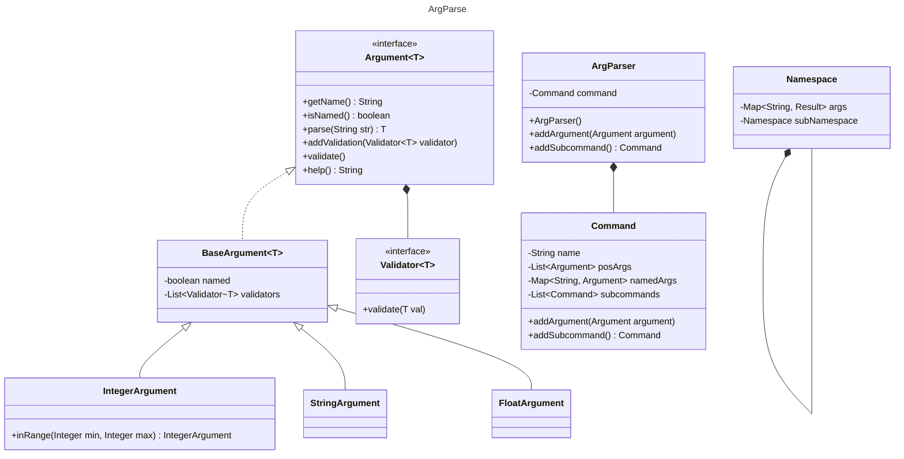

```mermaid
---
title: ArgParse
---
classDiagram
    class Argument~T~ {
        <<interface>>
        +getName() String
        +isNamed() boolean
        +parse(String str) T
        +addValidation(Validator~T~ validator)
        +validate()
        +help() String
    }
    Argument~T~ <|.. BaseArgument~T~
    BaseArgument: -boolean named
    BaseArgument: -List~Validator~T~ validators
    BaseArgument~Integer~ <|-- IntegerArgument
    IntegerArgument: +inRange(Integer min, Integer max) IntegerArgument
    BaseArgument~String~ <|-- StringArgument
    BaseArgument~Float~ <|-- FloatArgument
    Argument~T~ *-- Validator~T~
    <<interface>> Validator
    Validator: +validate(T val)
    class ArgParser {
        -Command command
        +ArgParser()
        +addArgument(Argument argument)
        +addSubcommand() Command
    }
    ArgParser *-- Command
    class Command {
        -String name
        -List~Argument~ posArgs
        -Map~String, Argument~ namedArgs
        -List~Command~ subcommands
        +addArgument(Argument argument)
        +addSubcommand() Command
    }
    class Namespace {
        -Map~String, Result~ args
        -Namespace subNamespace
    }
    Namespace *-- Namespace
```