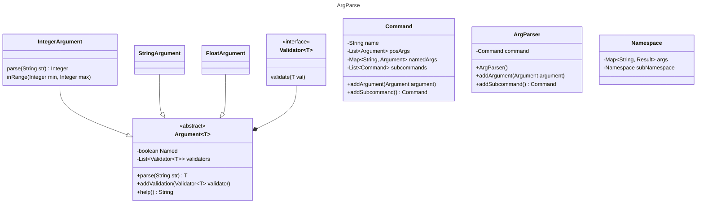

```mermaid
---
title: ArgParse
---
classDiagram
    class Argument~T~ {
        <<abstract>>
        -boolean Named
        -List~Validator~T~~ validators
        +parse(String str) T
        +addValidation(Validator~T~ validator)
        +help() String
    }
    IntegerArgument --|> Argument~Integer~
    IntegerArgument: parse(String str) Integer
    IntegerArgument: inRange(Integer min, Integer max)
    StringArgument --|> Argument~String~
    FloatArgument --|> Argument~Float~
    Validator~T~ --* Argument~T~
    <<interface>> Validator
    Validator: validate(T val)
    class Command {
        -String name
        -List~Argument~ posArgs
        -Map~String, Argument~ namedArgs
        -List~Command~ subcommands
        +addArgument(Argument argument)
        +addSubcommand() Command
    }
    class ArgParser {
        -Command command
        +ArgParser()
        +addArgument(Argument argument)
        +addSubcommand() Command
    }
    class Namespace {
        -Map~String, Result~ args
        -Namespace subNamespace
    }
```