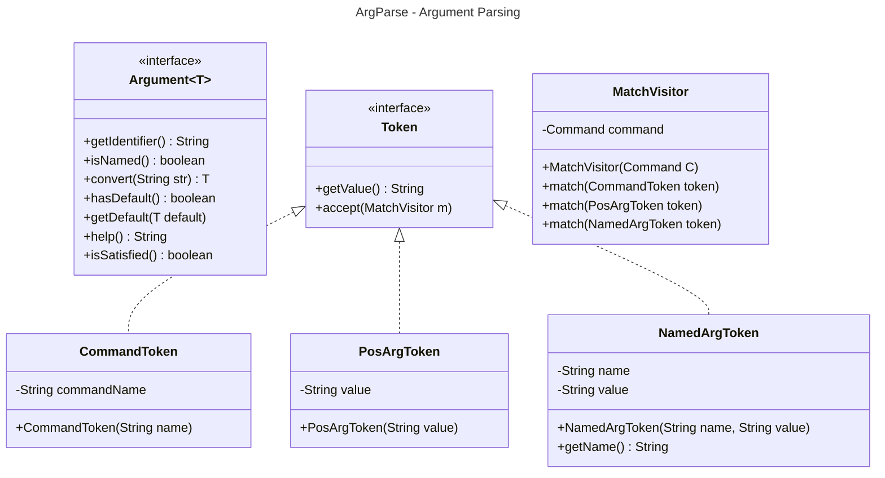

```mermaid
---
title: ArgParse - Argument Parsing
---
classDiagram
    class Argument~T~ {
        <<interface>>
        +getIdentifier() String
        +isNamed() boolean
        +convert(String str) T
        +hasDefault() boolean
        +getDefault(T default)
        +help() String
        +isSatisfied() boolean
    }
    class Token {
        <<interface>>
        +getValue() String
        +accept(MatchVisitor m)
    }
    Token <|.. CommandToken
    CommandToken: -String commandName
    CommandToken: +CommandToken(String name)
    Token <|.. PosArgToken
    PosArgToken: -String value
    PosArgToken: +PosArgToken(String value)
    Token <|.. NamedArgToken
    NamedArgToken: -String name
    NamedArgToken: -String value
    NamedArgToken: +NamedArgToken(String name, String value)
    NamedArgToken: +getName() String
    class MatchVisitor {
        -Command command
        +MatchVisitor(Command C)
        +match(CommandToken token)
        +match(PosArgToken token)
        +match(NamedArgToken token)
    }
```